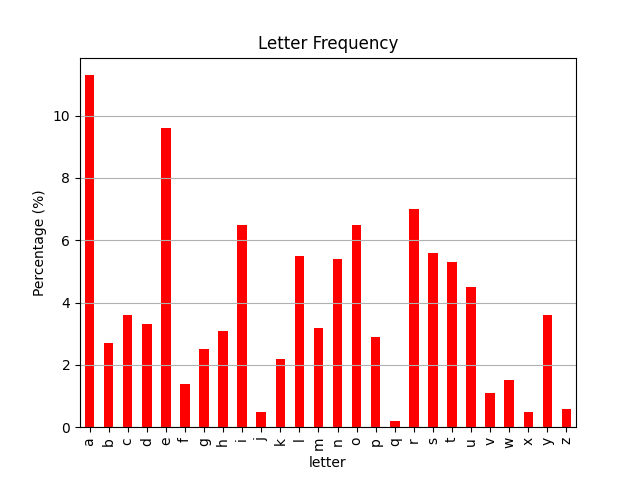

# Pandas, Mathplotlib, and Seaborn

## Overview

Pandas is a python package for data analysis used for managing, querying and processing data in python.  It is part of the Anaconda distribution, which is large suite of tools for data processing.  Installing pandas is platform dependent, so check your local distrubution for information on how to setup the installation and access via python code.  Instructions on installing the normal way are on the [pandas installation page](https://pandas.pydata.org/docs/getting_started/install.html).

This tutorial is intended as a quick start guide to using Pandas and other tools for data management and research.  There are many sources, but I am begining with the [pandas getting started](https://pandas.pydata.org/docs/getting_started/index.html) documentation.  Later in this document as I get into other documents I will identify other sources.  

## Dataframes

The basic unit of data is called a **DataFrame**, which is a 2-dimensional object representing a collection of data.  Each DataFrame is organized as a set of rows and columns, which you can conceptually think about as a spreadshet.  Each column has a name (generally) and rows contain data for an example of each of the things you are recording.  The table cells can hold text, numnber, floating point, categorical data, and more.  The data in a column is called a **series**.

##### Simple Example (example1.py)

    import pandas as pd
    data = (
        {
            "Counts": [10, 20, 30],
            "Colors": [ "red", "blue", "green" ],
        }
    )
    df = pd.DataFrame(data)
    print(df)

## Working with Series

Much of the work you will do relates to the processing of the data, and most of that will be extracting, projecting, creating, and manipulating series.  The simplist way to think about it is to remain thinking of the DataFrame as a table of data like you might see in Excel or SQL.

The most basic operation on at DataFrame is to access one of the series.  To do this, you just access it by the name of the field, just like an associative array with the key being the series name and the value being the array of values.  Note that you can also create series on the fly and use pandas functions to operate on and sumarize the data in the sample.  You can also create DataFrames on the fly using the series.

#### Series examples (example2.py)

    series = df["Tags"]
    print(series)
    grades = pd.Series([90, 80, 70, 65, 77, 98, 32, 99, 88, 86], name="Grades")
    print("The grades series:" + str(grades))
    grades.describe()
    print("The average grade is:" + str(grades.mean()))
    df2 = pd.DataFrame(grades)
    print("The grades dataframe:" + str(df2))

## Getting Data int and out of Pandas

Most of the time you will not be creating all of your data within a python program, but loading it from an external source.  The simplest way to do this is to use the built in Pandas functions.  The one I use most frequently is the read function for CSV (comma separated value) data format.  It is super simple, where you give it a file name and call the appropriate function.  The supported types include csv, excel, json, etc.  You can also export the data to different data types in a similar manner.  You simply call a "to" function on the DataFrame and it create the external file.  

Both the read and to functions have a lot of optional arguments you can pass into the call.  For example, you can also specify which series you would like to have treated as the index with *index_col*, which can either be an integer (which is the number of the column/series that is indexed) or a label which identifies the column by name.  You can export to a CSV and include a parameter of "index_col=False" to stop the export from including an index column (i.e., a column that lists a number of its placement in the list--1, 2, 3...). On write, you can specify whether you want to export the index with the *index* (oddly, not index_col) parameter.

#### Data loading example (example3.py)

    # Load files
    letfreq = pd.read_csv("data/wordle_freq.csv")
    print(letfreq)
    bigrams = pd.read_csv("data/wordle_bigram.csv", index_col="bigram")
    print(bigrams)
    trigrtam = pd.read_csv("data/wordle_trigram.csv", index_col=False)
    print(trigrams)

    # Export files
    letfreq.to_json("data/frequencies.json")
    bigrams.to_json("data/bigram_frequencies.json", index=False)

Ok, now we have our data in memory and ready to do something with it.  We will continue here with manipulating the data within Pandas, but if you are aching to jump right in and start looking at the data, you can jump down to the visualization part of this tutorial which covers [Mathplotlib](#mathplotlib), and thereafter to is child [Seaborn](#seaborn).

We are going to use the above frequency data for the following tutorials, where each of the three data frames has the same schemea:

       letter  count  frequency
    0       a   5810      0.113
    1       b   1379      0.027
    2       c   1839      0.036
    3       d   1680      0.033
    4       e   4905      0.096
    ...

The only difference between our three data sets is that the *letfreq* series is replaced with two or three letter combinations, *bigram* and *trigram*, respectively.  The output from example3.py shows you the data in a format that visualizes this.

### Getting data out of pandas

START HERE

To get a series, you simply refernce it like it is an associative array, e.g.,

    mylist = letfreq['frequency'].tolist()

For more complex extraction, there are two functions you use to extract row data from a data frame, loc() and iloc().  The difference between these two functions is that .iloc() accesses a particular element as identified by the an interger in index in the "index" series (specified at the creation of the Dataframe) and .loc() is referenced by label.

START HERE BY SHOWING HOW ILOC AND LOC WORK

-- Select rows where Age is greater than 25
df_filtered = df[df['Age'] > 25]
print(df_filtered)

    return avwx_airports['icaoId'].tolist() - get column

    return avwx_airports.loc['icaoId'].tolist() - get row

---

## Mathplotlib

Now that we have some data, we are going to want to do something with it.  For now, we just want to visuailze it, which means we want to create some figures that allow us to see something interesting about the data.  

The first thing to understand is a bit of terminology.  Within Mathplotlib, you operate on graphs where are valled **Figure**s, which may contain one more **Axes**.  Axes are specified in terms of x-y or x-y-z coordinate in whatever coordinate system you are using.

Most of the visualization happens within objects that are part of the library, where an object is some type of figure.  For this example, we will work with a bar chart.  There are really three steps to the process: (1) creating the plot object by calling a constructor and referecing the data series (or multiple series), (2) modifying the style and content by calling various annotation call, and (3) directing the output to a file or interface.

#### Mathplotlib example (mpl_example1.py)

    # Load the data
    letfreq = pd.read_csv("data/wordle_freq.csv", index_col='letter')
    print(letfreq.head())
    barser = letfreq['frequency'].transform(lambda x: x*100)

    # Plot the data using steps #1 (create), #2 (add style), and #3 (output)
    barchart = barser.plot.bar(column='frequency', color='red', ylabel='Percentage (%)')
    barchart.grid(axis='y', zorder=0)
    plt.savefig("data/wordle_freq_bar.png")

A thing to note here are the modification of the frequency using the transform function.  Here, the transform() calls the lambda function on each entry in the series to create a new series.  This is one of the cool ways to quickly derive data--we will talk about a bunch of others later in this tutorial.

The latter linmes show to create the barchart object with a few parameters to specify sytle, what data to plot, etc.  All of this is pretty self explainitory.  The second part makes a grid() call which add, not surprisingly a grid.  The thing to note is that almost everything can be added either through parameters on the constructor or using subsequent calls.

The last part is a little weird.  We call the savefig() function which writes the plot to a file.  However, there is no reference to the object we just created.  The key here is that the plotting function implictly references the last thing you were working on.  Here, the oddity is that the designers of the library decided to expose both an object based and non-object based function.  This is a great source of confusion to new users I understand.

Here is what the output of this simple graph looks like:

---

Types of figures

bar

histogram - takes a series and bins them into descrete values, calculates the numbers of occurences in each bin.

---

## Seaborn

Seaborn is a wrapper for the Mathplotlib which greatly simplifies and enhances creating visuals.  It handles the same kinds of data frame, series (arrays) as matplotlib and generates plots as direct.  You cal also access the underlying matplotlib functions to fine tune your objects.

One of the concepts seaborn introduces is the notion of a theme, which is a overarching set of parameters for images.  Basically, it is a set of optimizations for your plots which makes things work faster, easier, and look nicer.  For most people using the default theme is sufficient.  Under the hood, this is interacting with the matplotlib rcParam system.

Perhaps the most powerful call in seaborn is to the relplot() function, which can create any number of visualizations from very simple inputs.  Basically, it shows the relationship between two variables in the form of a scatter or line plot.