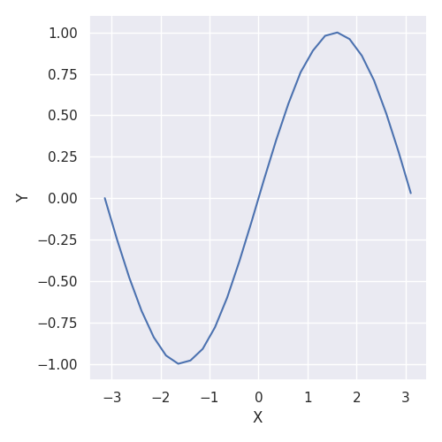
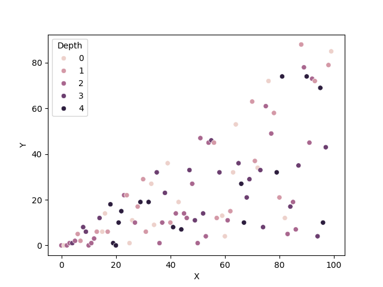

# Pandas, Mathplotlib, and Seaborn

## Overview

[Pandas](https://pandas.pydata.org/) is a python package for data analysis used for managing, querying and processing data in python.   Described later, [Mathplotlib](https://matplotlib.org/) and [Seaborn](https://seaborn.pydata.org/) are packages for data visualization.  Widely used in scientific computing, paper writing, AI, and other fields, the related tools provide programming interfaces to create figures that highlight trends and other artifacts of data.  This tutorial is intended as a quick start guide to using Pandas and other tools for data management and research.

## Pandas

Pandas is part of the Anaconda distribution, which is large suite of tools for data processing.  Installing pandas is platform dependent, so check your local distrubution for information on how to setup the installation and access via python code.  Instructions on installing the normal way are on the [pandas installation page](https://pandas.pydata.org/docs/getting_started/install.html).  Note here that I am using the [pandas getting started](https://pandas.pydata.org/docs/getting_started/index.html) documentation as a starting place (more detail available there). 

### Dataframes
The basic unit of data is called a **DataFrame**, which is a 2-dimensional object representing a collection of data.  Each DataFrame is organized as a set of rows and columns, which you can conceptually think about as a spreadshet.  Each column has a name (generally) and rows contain data for an example of each of the things you are recording.  The table cells can hold text, numnber, floating point, categorical data, and more.  The data in a column is called a **series**.

##### Simple Example (example1.py)

    import pandas as pd
    data = (
        {
            'Counts': [10, 20, 30],
            'Colors': [ 'red', 'blue', 'green' ],
        }
    )
    df = pd.DataFrame(data)
    print(df)

### Working with series

Much of the work you will do relates to the processing of the data, and most of that will be extracting, projecting, creating, and manipulating series.  The simplist way to think about it is to remain thinking of the DataFrame as a table of data like you might see in Excel or SQL.

The most basic operation on at DataFrame is to access one of the series.  To do this, you just access it by the name of the field, just like an associative array with the key being the series name and the value being the array of values.  Note that you can also create series on the fly and use pandas functions to operate on and sumarize the data in the sample.  You can also create DataFrames on the fly using the series.

#### Series examples (example2.py)

    series = df['Tags']
    print(series)
    grades = pd.Series([90, 80, 70, 65, 77, 98, 32, 99, 88, 86], name='Grades')
    print('The grades series:' + str(grades))
    grades.describe()
    print('The average grade is:' + str(grades.mean()))
    df2 = pd.DataFrame(grades)
    print('The grades dataframe:' + str(df2))

### Getting Data into and out of Pandas

Most of the time you will not be creating all of your data within a python program, but loading it from an external source.  The simplest way to do this is to use the built in Pandas functions.  The one I use most frequently is the read function for CSV (comma separated value) data format.  It is super simple, where you give it a file name and call the appropriate function.  The supported types include csv, excel, json, etc.  You can also export the data to different data types in a similar manner.  You simply call a 'to' function on the DataFrame and it create the external file.  

Both the read and to functions have a lot of optional arguments you can pass into the call.  For example, you can also specify which series you would like to have treated as the index with *index_col*, which can either be an integer (which is the number of the column/series that is indexed) or a label which identifies the column by name.  You can export to a CSV and include a parameter of 'index_col=False' to stop the export from including an index column (i.e., a column that lists a number of its placement in the list--1, 2, 3...). On write, you can specify whether you want to export the index with the *index* (oddly, not index_col) parameter.

#### Data loading example (example3.py)

    # Load files
    letfreq = pd.read_csv('data/wordle_freq.csv')
    print(letfreq)
    bigrams = pd.read_csv('data/wordle_bigram.csv', index_col='bigram')
    print(bigrams)
    trigrtam = pd.read_csv('data/wordle_trigram.csv', index_col=False)
    print(trigrams)

    # Export files
    letfreq.to_json('data/frequencies.json')
    bigrams.to_json('data/bigram_frequencies.json', index=False)

Ok, now we have our data in memory and ready to do something with it.  We will continue here with manipulating the data within Pandas, but if you are aching to jump right in and start looking at the data, you can jump down to the visualization part of this tutorial which covers [Mathplotlib](#mathplotlib), and thereafter to is child [Seaborn](#seaborn).

We are going to use the above frequency data for the following tutorials, where each of the three data frames has the same schemea:

       letter  count  frequency
    0       a   5810      0.113
    1       b   1379      0.027
    2       c   1839      0.036
    3       d   1680      0.033
    4       e   4905      0.096
    ...

The only difference between our three data sets is that the *letfreq* series is replaced with two or three letter combinations, *bigram* and *trigram*, respectively.  The output from example3.py shows you the data in a format that visualizes this.

#### Extracting data from data frames

To get a series, you simply reference it like it is an associative array, e.g.,

    print(letfreq['frequency'])
    mylist = letfreq['frequency'].tolist()

For more complex extraction, there are two functions you use to extract row data from a data frame, loc() and iloc().  The difference between these two functions is that .iloc() accesses a particular element as identified by the an interger in index in the 'index' series (specified at the creation of the Dataframe) and .loc() is referenced by label.  The function .at() also works like loc but is used for accessing a row/column cell and will raise a KeyError if it does not find that element.  You can add both row and column to access individual elemements (see below).

    # Show a row of the table by index reference and integer row number
    print(letfreq.loc['b'])
    print(letfreq.iloc[1])

    # Show a cell of the table referenced by row/column
    print(letfreq.loc['b', 'frequency'])
    print(letfreq.at['b', 'frequency'])
    print(letfreq.iloc['1', '2'])

Referencing data from pandas is very flexible.  You can extract by range or by selecting by a conditional value.  There are lots of options for the conditions that can test for value, wether some value is in a series, etc.  There is an extensive tutorial on [selection within data frames](https://pandas.pydata.org/docs/user_guide/indexing.html) documentation from the Pandas folks.  Some interesting examples include:

    # Show a range of values in a series
    print(letfreq.iloc[1, 0:2])

    # lastly, you can filter by a condition or conditions
    print(letfreq[letfreq['frequency'] > 0.05])
    print(letfreq[(letfreq['frequency'] > 0.05) & (letfreq['count'] > 3000)]

## Mathplotlib

Now that we have some data, we are going to want to do something with it.  For now, we just want to visuailze it, which means we want to create some figures that allow us to see something interesting.  We will initially talk about mathplotlib, which is a visulization framework for data (see documentation and tutorial [here](https://matplotlib.org/stable/users/index.html#users-guide-index)).  Later (below), we will talk about Seaborn, which is an extension of the mathplotlib library with lots of cool extensions and modifications to make the plots easier to code and look better.

The first thing to understand is a bit of terminology.  Within Mathplotlib, you operate on graphs where are called **Figure**s, which contains **Axes**, which in turn may contain one more **Axis** (we dicuss the difference between these objectt below--keenly the difference between Axes and Axis objects/data structures).  Looking a bit ahead, Axis are ways to plot data that are specified in terms of x-y or x-y-z coordinate in whatever coordinate system you are using.  There are other things like labels, legends, grids, spines, and whole lot more.  The best way to visualize it all is looking a the diagram provided by the matplotlib documentation.

I will describe what all of those mean and how to control many of them later.  However, before getting into more complex use of graphs, data frames, etc.  lets do the simplest form of graph creation.  You can simply create a figure and subplot (which is a kind of way to create an axes) by calling a base generator called .subplots().  You then can add data by plotting via plot() and then show it using show().

#### Mathplotlib example (mpl_example1.py)

    import matplotlib.pyplot as plt

    data = [
      [-3.14,-2.89,-2.64,-2.39,... # real data in python file
      [-0.00,-0.25,-0.48,-0.68,...
    ]

    # Create the Figure and Axes
    fig, ax = plt.subplots()
    ax.plot(data[0], data[1])
    # plt.show()
    plt.savefig('data/mpl_pi_chart.png')

Note that the show() function is going to render the plot in a window of the local environment.  If you are like me and use a container for working with data, you will need too export the image to a file, which is most often done through the use of the plt.savefig() function.

Here is what the output of this simple graph looks like:

Of course, for most purposes you want to do something a bit more compllicated.  To start with, most of the visualization happens within objects that are part of the library, where an object is some type of figure.  For the next example, we will work with a bar chart.  There are three steps to creating a visualization: (1) creating the plot object by calling a constructor and referecing the data series (or multiple series), (2) modifying the style and content by calling various annotation calls, and (3) directing the output to a file or interface.  One simple example of this is:

#### Mathplotlib example (mpl_example2.py)

    # Load the data
    letfreq = pd.read_csv('data/wordle_freq.csv', index_col='letter')
    barser = letfreq['frequency'].transform(lambda x: x*100)

    # Plot the data using steps #1 (create), #2 (add style), and #3 (output)
    barchart = barser.plot.bar(column='frequency', color='red', ylabel='Percentage (%)')
    barchart.grid(axis='y', zorder=0)
    plt.title('Letter Frequency')
    plt.savefig('data/mpl_wordle_freq_bar.png')

We have seen in the previous section about loading the data frame using the .read_csv() function.  Next we select some set of data and transform it.  Here, the transform() calls the lambda function on each entry in the series to create a new series.  This is one of the cool ways to quickly derive data--we will talk about a bunch of others later in this tutorial.

The latter lines create the barchart object with a few parameters to specify sytle, what data to plot, etc.  All of this is pretty self explainitory.  The second part makes a grid() call which add, not surprisingly grid lines (in this case the y-axis only).  The thing to note is that almost everything can be added either through parameters on the constructor or using subsequent calls.

The second thing to note is the *zorder* paramater which allows you to control the order to which things are rendered--in this case a zorder of 0 means drop on top of everything else.  The result is that the grid lines are on top of the bar chart which makes their value a bit easier to judge.  Generally speaking, you can use zorder on almost all things to have precise control over the ordering of rendering.

A note on setting the title and saving the file which is frankly is a little weird.  For the latter, we call the savefig() function which writes the plot to a file.  However, there is no reference to the object we just created.  The key here is that the title and plotting functions implictly reference the last thing you were working on.  Here, the oddity is that the designers of the library decided to expose both an object based and non-object (called implicit) interface.  This is a great source of confusion to new users I understand, but generally speaking you can do anything either with the object or non-object interface.

Getting back to our example, this is the result output of this bar chart graph:

We now turn to the most general object mentioned above, **Figure**.  A Figure is a whole region of visualization that you will visualize data in.  An Axes is a region for plotting data, where as an Axis is a particaular x, y, or z part of the figure which you put labels, tick marks, etc. on.

The most straightforward figures are the onese where you create a figure, set title, axes, tics, gridlines, and then plot a few data series and go.  Below is a pretty involved but straighforward use of the basic interfaces for creating a graph:

#### Mathplotlib example (mpl_example3.py)

    maxval = 15
    numbers = np.arange(maxval)
    squares = np.fromfunction(lambda x: x**2, (maxval,))
    cubes = np.fromfunction(lambda x: x**3, (maxval,))

    fig, ax = plt.subplots()
    ax.set_title('Squares, Cubes, and Fourths')
    ax.set_xlabel('$x$')
    ax.set_xticks(numbers)
    ax.set_ylabel('$y = x^2$', color='blue')
    ax.set_ylim(0, maxval**2)
    ax.set_yticks(squares[3:])
    ax.plot(numbers, squares)
    ax.plot(numbers, cubes, 'yp')
    ax.plot(numbers, [x**4 for x in range(maxval)], 'g--')
    ax.legend(['Squares', 'Cubes', 'Fourths'], loc='upper left')
    plt.grid(color='green', linestyle='--', linewidth=0.5)
    plt.savefig('data/mpl_numbers.png')

A couple of notes here.  When you specify ticks you have to indicate all of the tic marks you will want marked on the figure via an array of values.  In the case of this graph, I have marked every plotted value on the x axis and all of the squares starting with 3 on the y axis (if I did all of the squares the log plotting would mash together 1 and 4 and look terrible).  Also note that I simply included multiple plots to add multiple series in the data.

The plot() function is incredibly flexible (as one would expect).  Loking at the second plot, I have added an optional second paramter to the cubes data which is the symbol format, where '*yp*' sets the points to be plotted as yellow pentagon (see documentation for format options).  The fourths is even more interesting, where I have created a data series on the flyu and given it a green dashed line for plotting (the 'g--' parameter).  There are lots of parameters laid out in the documentation page for [plot()](https://matplotlib.org/stable/api/_as_gen/matplotlib.pyplot.plot.html).  Suffice to say you can set colors, line styles, point sytles, and a multitude of other things.

Lastly, you can create a legend that decribes all of the data types you are plotting.  Again, very customizable.  There are other ways of setting the legend values but what is in the sample code  is the simplest.

Viaually, this is the result of all of this work:

There are all kinds of plots with different options (see [here](https://matplotlib.org/stable/plot_types/index.html) for a list and some demonstrations).  You can also create a figure with mutiple plots, axes, etc.  The limtations are boundless and they grow in depth every day.

One last example shows some of this power and deomstrates a couple of plot types, namely scatter and error bar plots.  See here:

#### Mathplotlib example (mpl_example4.py)

    sctrx = np.random.randint(0, 100, 100)
    sctry = np.random.randint(0, 100, 100)

    errbarx = np.arange(0,100,5)
    errbary = np.random.randint(0, 100, 20)
    errbar_error = np.random.randint(10, 25, 20)

    fix, axes = plt.subplots(2, 1)
    axes[0].scatter(sctrx, sctry, color='red')
    axes[0].set_title('Scatter Plot')
    axes[0].grid(True)
    axes[1].errorbar(errbarx, errbary, yerr=errbar_error, fmt='o')
    axes[1].set_title('Error Bar Plot')
    axes[1].grid(True)
    plt.tight_layout()
    plt.savefig('data/mpl_complex.png')

Getting into this code, you can see the plot begins with the creation of a 2 by 1 (stacked) set of plots.  Once we have those, we can do all of the things we did above--but this time to each index of the array of axes--including setting titles, grids, etc.  Lastly, we include the tight_layout() function because it ensures the data layout allows for the annotations of the different axes to not interfer (i.e., overlay) each other.  The resulting figure looks like this:

## Seaborn

Seaborn is a wrapper for the mathplotlib which greatly simplifies and enhances creating visuals.  In short, the result of Seaborn is to make figures which appear to be more stylized (some would say more modern and professional).  It handles the same kinds of data frames, series (arrays) as pandas and matplotlib and generates plots as direct.  Seaborn is built on top of matplotlib, so You call also access the underlying matplotlib functions to fine tune your objects.

One of the concepts seaborn introduces is the notion of a theme, which is a overarching set of parameters for images.  Basically, it is a set of optimizations for your plots which makes things work faster, easier, and look nicer.  For most people using the default theme is sufficient.  Under the hood, this is interacting with the matplotlib rcParam system.

Perhaps the most powerful call in seaborn is to the relplot() function, which can create any number of visualizations from very simple inputs.  Basically, it shows the relationship between two variables in the form of a scatter or line plot.

Starting from the beginning, lets do another the first simple plot from the previous section only this time with Seanborne.  Here, I use the pandas version of the data creation rather than the hardcoded definition.  The code here is:

#### Seaborn example (sns_example1.py)

    data = pd.DataFrame()
    data['X'] = pd.array(np.arange(-3.14, 3.14, 0.1))
    data['Y'] = pd.array([(math.sin(x)) for x in np.arange(-3.14, 3.14, 0.1)])

    sns.set_theme()
    df = pd.DataFrame(data)
    sns.relplot(df, x='X', y='Y', kind='line')
    plt.savefig('data/sns_pi_chart.png')

There are really two lines of Seaborn here (the data frame and savefig() code is the same as above).  The first is set_theme(), which is a function to, well, set the theme.  Without the argument it defaults the standard theme.  However, the function is quite flexible and can be used to set a lot of paramters used to style the theme such as pallet, style. etc.  See the documentation for [set_theme()](https://seaborn.pydata.org/generated/seaborn.set_theme.html) for more information.

The second function, relplot() is really the function used to setup the whole figure.  In this case a relative plot which visualizes relationships between variables in a dataset (in this case a data frame showing y=sin(x)).  The only non-obvious part of this is X and Y, which refer to series in the data frame to perform the relative plot on.

Now turning to perhaps a more interesting graph, lets look at an example of a scatter plot.  Here, we have some complex data that we want to show on a graph that has X-Y points with a category and a size for each data point.  Example code would be:

    words = ['Uno', 'Dos', 'Tres']
    data = pd.DataFrame()
    data['X'] = pd.array(np.arange(0, 100))
    data['Y'] = pd.array([(np.random.randint(0,x+1)) for x in data['X']])
    data['Category'] = pd.array([words[(np.random.randint(0,len(words)))] for x in range(0,100)])
    data['Size'] = pd.array([(np.random.randint(0,5)) for x in range(0,100)])

    sns.set_theme()
    sns.scatterplot(data, x='X', y='Y', hue='Category', size='Size', legend='full')
    plt.title('Scatter Plot')
    plt.savefig('data/sns_scatter.png')

To start with we construct a somewhat complex data frame that has an X and Y coordinates, a category, and a size.  These are used to define where a point goes (X,Y), what series is used to plot different kinds of items (Category), and how big to make each point (size).  

Taking a look at the data frame, we have:

         X   Y Category  Size
    0    0   0      Dos     3
    1    1   1      Dos     2
    2    2   2      Uno     2
    3    3   2      Uno     1
    4    4   3      Uno     2
    ..  ..  ..      ...   ...
    95  95  73     Tres     2
    96  96  17      Dos     4
    97  97  54      Dos     3
    98  98  55     Tres     0
    99  99  98      Uno     2

The code them simply uses the different series to plot the parts of the graph and lay it out with the X-Y location, category (which is configure withh 'hue') and size of the points.  Like all the rest, we set the theme.  Once done, we can then call the regular plot functions to add annotations, titles and all sorts of other things.  See the [documentation](https://seaborn.pydata.org/generated/seaborn.scatterplot.html) for scatter plot for more detail.  The finshed graph looks nice:

#

Moving on, perhaps the classical Seaborn graph is the heat map, which details the relationship between categories of data amongst themselves.  We see this a lot in ML work where we look at the ability of things like transferability amongst models.  Here is the code:

    words = [['Uno', 'Dos', 'Tres', 'Quarto'], ['Un', 'Duex', 'Trois', 'Quatre']]
    data = pd.DataFrame()
    data['index'] = pd.Series(words[0])
    data.set_index('index', inplace=True)
    for i in range(0, len(words[1])):
        data[words[1][i]] = np.random.randint(0, (i+1)*25, len(words[0]))

    sns.heatmap(data, annot=True, fmt='.2f')
    plt.title('Heatmap')
    plt.savefig('data/sns_heatmap.png')

Again, the trick is making sure the data frame is setup correctly.  In this case, the data portion of the heatmap must be a rectangular data with an index being the Y labels and the remaining series being the X axis.  Styling as cool, settting colors etc. is all supported.  Some other things of note are the annotation (which creates the text inside each of the cells of the grid), and fmt (format, which sets how the numbers are formatted using the printf style decriptors).  See documentation for heatmaps for more detail.  The resulting figure is:

#
